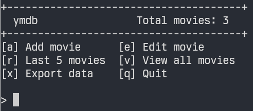

# Your Movie Database

`ymdb` is a simple, terminal-based movie tracker using data that belongs to you.



## Features

- Track movie data using a local SQLite database.
- Export data for analysis or record keeping

## Installation

*From source*

```sh
git clone https://github.com/chrisalcantara/ymdb.git
cd ymdb
cargo install --path .
```
To remove, run `cargo uninstall ymdb`.

## Quickstart

After installing the binary (or running within the project using `cargo run`), `ymdb` will create a configuration folder at `$HOME/.config/ymdb` and initialize an SQLlite database with a table called `movies` with the following columns:

```txt
title:  VARCHAR(255)
genre:  VARCHAR(255)
rating: INTEGER
```
